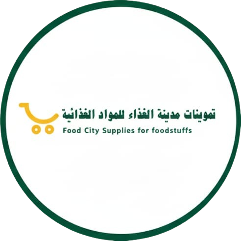

---

# 🌆 Food City Supplies for Foodstuffs

<p align="center">
  
</p>

<p align="center">
  <b>High-Quality Food Supply Website (Bilingual EN / AR)</b><br>
  🇸🇦 Built for Saudi Arabia • Modern • Responsive • PWA Ready
</p>

---

## 🌟 Overview

**Food City Supplies for Foodstuffs** is a bilingual business website built for a trusted food supplier in Saudi Arabia.

It is designed to serve:

* 🏪 Supermarkets
* 🍽 Restaurants
* 🛒 Grocery Stores
* 🏢 Businesses & Bulk Buyers

The website focuses on performance, clean design, and professional presentation.

---

## 🎨 Features

### 🌐 Bilingual Support

* English 🇬🇧
* Arabic 🇸🇦 (RTL support)
* Language toggle with localStorage

### 🌙 Smart Dark Mode

* Manual toggle button (🌙 / ☀️)
* Auto dark mode after 6 PM
* Saves user preference
* Animated gradient background
* Glassmorphism cards
* Logo auto-switch (light/dark)

### 🎬 Modern UI Animations

* Hero zoom animation
* Scroll fade-in animations
* Smooth transitions
* Hover glow effects
* Floating animated logo
* Premium dark theme

### 📱 Fully Responsive

* Mobile-first layout
* Optimized hero positioning
* Clean grid system
* RTL alignment polish

### 📦 Sections Included

* Hero Section
* About Us
* Products Grid
* Why Choose Us
* Testimonials
* Contact Form (Formspree)
* Google Maps Embed
* WhatsApp Floating Button
* Partners / Certifications (optional)

### 🚀 PWA Ready

* `manifest.json`
* Installable on mobile
* Theme color support
* App icons

---

## 🛠 Tech Stack

```bash
HTML5
CSS3
Vanilla JavaScript
IntersectionObserver API
LocalStorage API
Formspree Integration
Google Maps Embed
```

No frameworks. Lightweight. Fast.

---

## 📁 Project Structure

```
/css
   style.css
   dark-mode.css

/js
   main.js
   dark-mode.js

index.html
manifest.json
logo.png
logo-dark.png
hero-food.png
```

---

## 🎯 Performance Focus

* Optimized animations
* Modular CSS structure
* Separated dark mode files
* Mobile-friendly hero
* Lightweight implementation

---

## 🌈 Design Philosophy

✔ Clean
✔ Professional
✔ Trustworthy
✔ Modern
✔ Business-Oriented
✔ Optimized for Saudi Market

---

## 📞 Contact

**Food City Supplies for Foodstuffs**
📧 [madinafoodcity@gmail.com](mailto:madinafoodcity@gmail.com)
📱 +966 53 428 5159
📍 Saudi Arabia

---

## 💡 Future Improvements

* Product category filtering
* Admin dashboard
* SEO structured data
* Multi-page expansion
* Backend integration

---

## 📄 License

This project is developed for business use.
All rights reserved © 2026 Food City Supplies for Foodstuffs.

---
